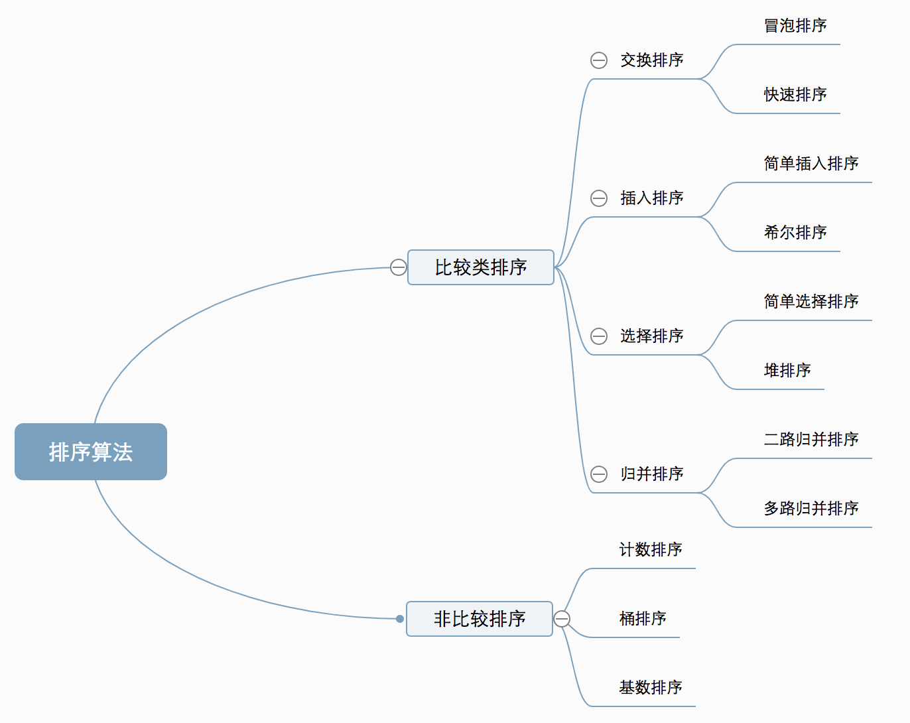
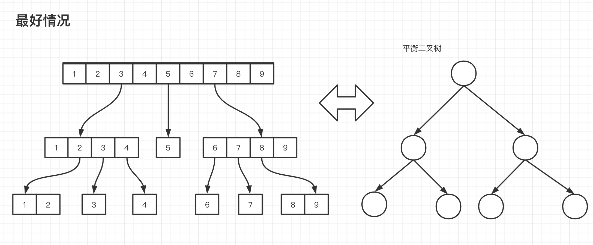
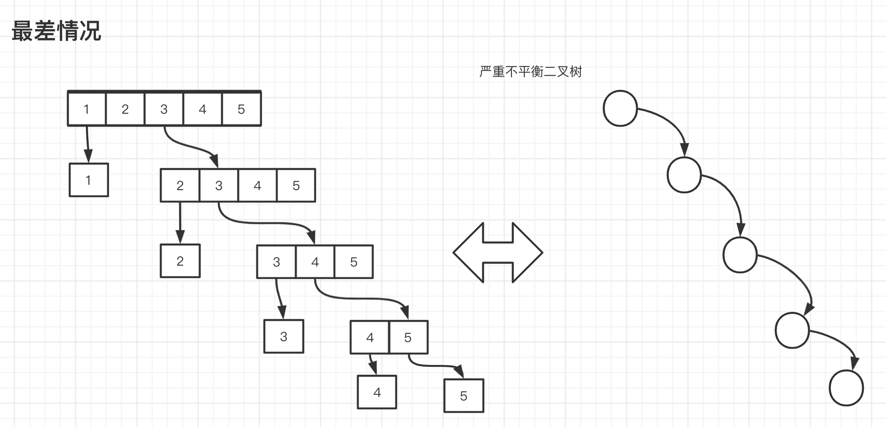

# 排序算法
计算机处理的是数据，那么怎么处理数据就是计算机中要研究的核心课题之一。现在我们一般把数据处理分为存储，遍历。存储的目标是使用尽可能少的空间存尽可能多的数据
而遍历则是要用尽可能少的时间在尽可能多的数据中查到想要的结果。

这里的排序其实就是对已有数据进行重新组织，使得这些数据可以被更方便的遍历和查找。目前常见的排序算法可以归纳为如下几种。我们后面可以按照由简到难顺序学习这
些排序算法。


## 冒泡排序
冒泡排序算法其实比较简单，就是从数组的前两个数据开始进行两两比较。如果后面的数据比前面的数据大(或者小)，那么就对这两个数据进行交换。
这样交换下来，就会形成一个升序(降序)的有序数组。

伪代码：
```java
    int[] arr;
    // 当前元素指针
    for(int i = 0; i < arr.length - 1; i++) {
        //  比较元素指针
        for(int j = i + 1; j < arr.length; j++) {
            if(arr[i] > arr[j]) {
                // 交换    
            }
        }
    }
```
通过上面代码可以知道，对于外层循环的每个元素，都要在内层循环循环一遍
所以，冒泡算法的时间复杂度是O(n^2)

## 快速排序
快排的思路是：在数组中找一个基准位，比如第一个元素。从数组的首位分别与基准位比较，将比基准位
大的元素放到右边，比基准位小的数字放到左边。经过第一轮排序后，将原来的数组分为两部分，对这两
部分继续按照上面的流程进行排序。

### 思路
本质上就是将数组分为三个部分：基准位，小于基准位左子数组，大于基准位的右子数组。
然后通过递归的方式分别对左右子数组再次进行拆分排序。

### 快排框架
```java
    sort(arr, lo, hi){
        // 递归终止条件
        if(startPos >= endPos) {
            return;
        }
        
        // 分区中间位置
        j = partition(arr, lo, hi);
        // 递归进行左数组排序
        sort(arr, lo, j - 1);
        // 递归进行右数组排序
        sort(arr, j + 1, hi);
    }
```
partition伪代码：
```java
    // 选择基准位
    int tmp = arr[0];
    int l = lo - 1; r = hi + 1;
    while(true) {
        // 从右向左扫描 直到扫描到数组的边界
        while(arr[--r] >= tmp) {
            if(r == lo) {
                break;    
            }
        }
        
        // 从左向右扫描
        while(arr[++l] <= tmp) {
            if(l == hi) {
                break;    
            }
        }
        
        if(r <= l) {
            break;
        }
        
        // 两者交换
        swich(arr, l, r);
    }
    
    // 将基准位放置到正确的位置
    swich(arr, lo, r);
    
    return r;
```

#### 快速排序优化
1. 对于小数组，插入排序性能会比快速排序更好。所以在实际应用中可以添加一个判断，如果数组元素小于
某一个阈值的时候，直接使用插入排序算法对数组进行排序。
2. 由于快排最优的情况是：每次数组拆分最好都能从数组正中间进行。所以，为了避免数组拆分的均衡
可以在排序之前对给定数组进行打乱。并且在选择基准位的时候可以随机进行。

#### 快速排序的时间复杂度计算
**最优情况下：**      
将N个元素的数组每次进行均匀切分，那么最终会形成一个平衡二叉树。这棵树的深度为
lg(N + 1)


二叉树在每一层的计算次数：  
第一层 N  
第二层 左子数组：N/2  右子数组：N/2  
第三层 左子的左子数组：N/4  左子的右子数组：N/4 右子的左子数组：N/4 右子的右子数组：N/4
...
第H层 ...

可以看到每一层的扫描次数总和为N，那么整棵二叉树总扫描次数为NH,N为数组元素总数，H为树的
深度。其中H=lg(N + 1)  
那么时间复杂度  O(T)≈ N*lgN


**最差情况**        
对于已经排好序的数组，假如每次都用数组的第一个元素作为基准元素。那么每次左子数组为空数据，右
子数组则是除了最小元素外的其他元素。

这种情况下，每一层都会扫描N次，并且二叉树的高度为N，所以时间复杂度为
O(T)=N^2


